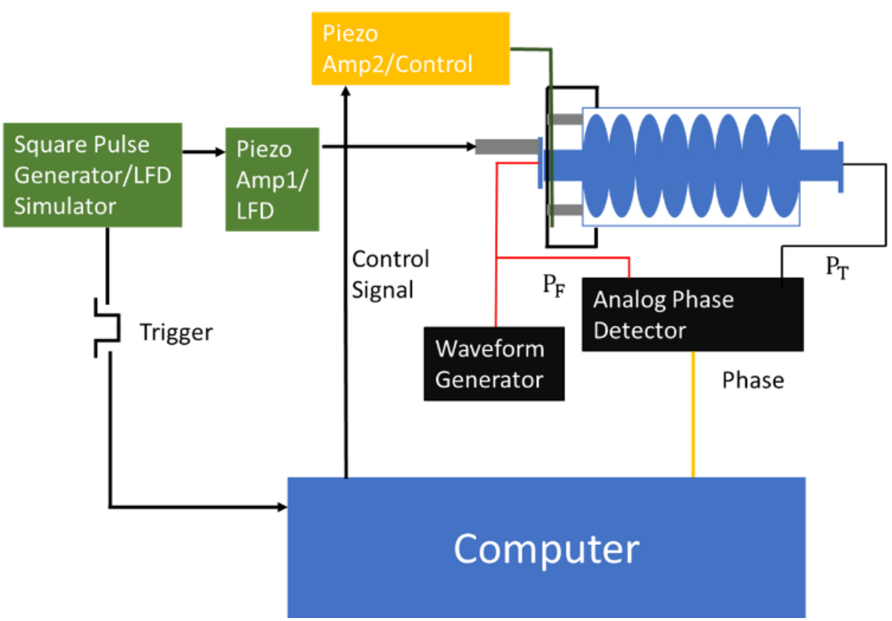
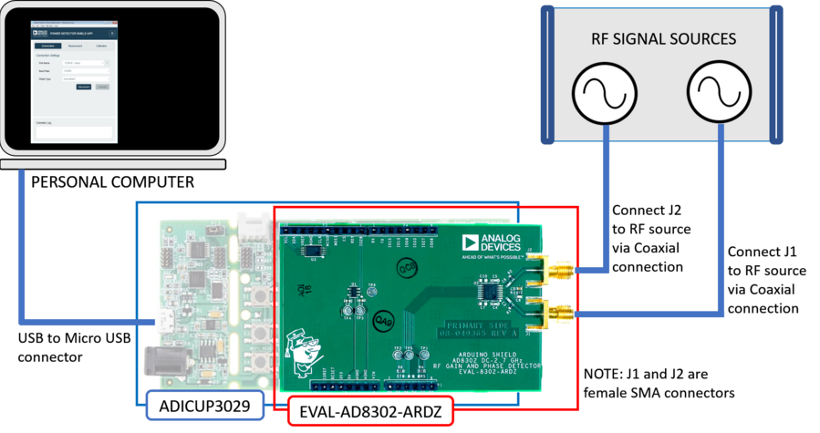

## **实验目的**

研究室温下模拟动态洛伦兹力失谐及调谐器补偿。

##  **实验步骤**

- 设计并搭建失谐模拟装置，包括超导腔、调谐器、信号发生器、相位检测器和控制系统。
- 将失谐模拟装置与超导腔连接。
- 施加失谐脉冲信号给shaker piezo，模拟洛伦兹力失谐。
- 测量超导腔的响应和调谐器补偿性能。

##  **实验要求**

- 确保失谐模拟装置能够提供稳定的仿真洛伦兹力脉冲信号。
- 测量和记录超导腔的响应和调谐器补偿性能数据。
- 进行数据分析和结果解释。

##  **实验设备**

## **实验设备**

- 实验台：用于固定超导腔、调谐器、shaker piezo位置。
- 超导腔：用于产生失谐信号。
- shaker piezo：用于模拟动态洛伦兹力失谐。
- 任意波发生器：给piezo提供失谐或者补偿信号。
- 控制系统：用于控制驱动信号以及补偿信号。
- 相位检测器：用于检测前向相位和提取相位的相位差。
- 线缆和接头：用于连接各个设备。

## 设备采购方案

1. **相位检测器**

## 

##

- [EVAL-AD8302-ARDZ](https://wiki.analog.com/resources/eval/user-guides/eval-ad8302-ardz)：
    - Input RF Frequency Range: DC to 2.7GHz
    - Input RF Power Range: -60dBm to 0dBm
    - Supply:
        1. Voltage: 5V
        2. Operates at around 35mA
    - Output Voltage Range:
        - VMAG: ~30mV to ~1.8V
        - VPHASE: ~30mV to ~1.8V
        - VREF: ~1.72V to ~1.88V

## 
- [EVAL-ADICUP3029](https://www.analog.com/en/resources/evaluation-hardware-and-software/evaluation-boards-kits/EVAL-ADICUP3029.html#eb-overview):
    - Compatible with Arduino, PMOD and Grove form factors
    - Ultra-low Power ARM Cortex M3
    - Open Source IDE Tools
    - No External Debugger/Emulator Tools needed