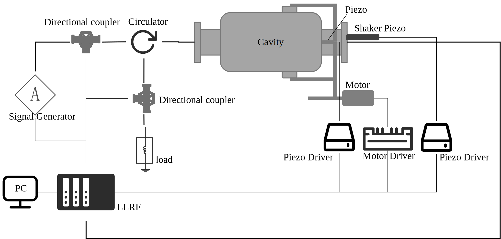
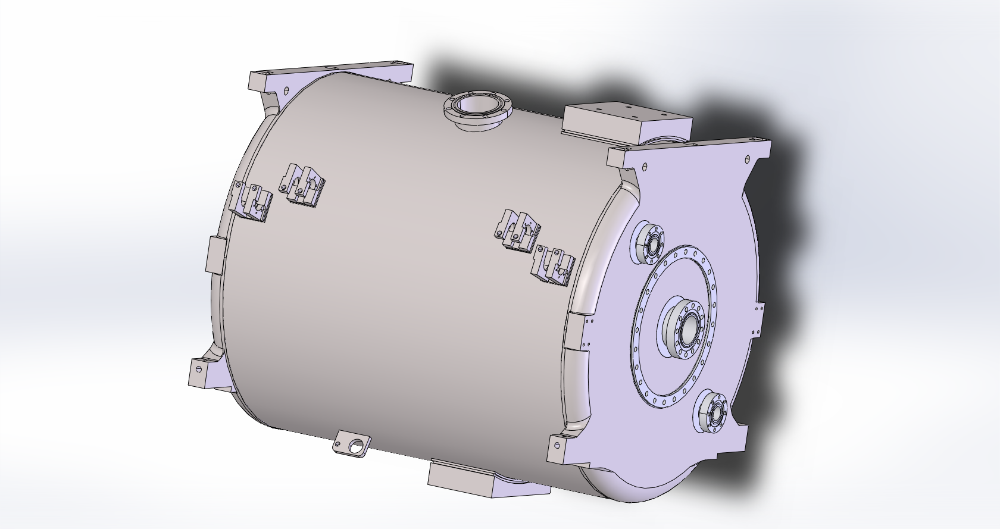
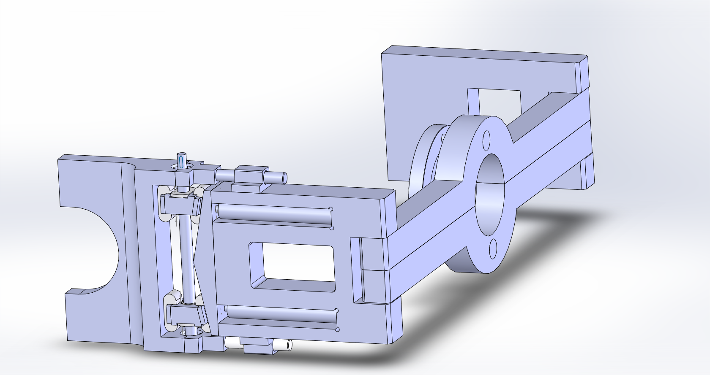
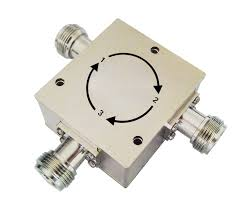
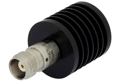
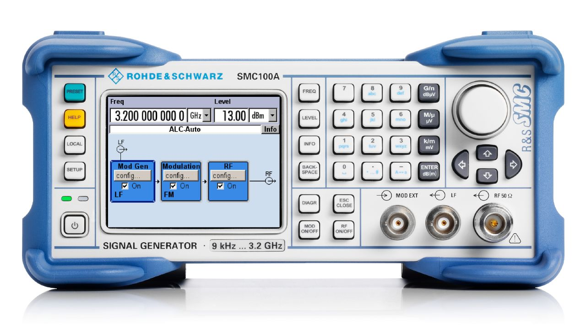
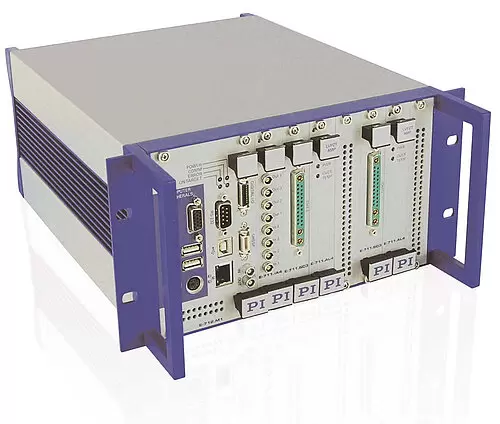
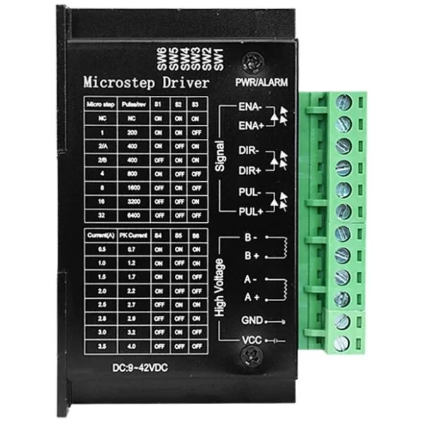
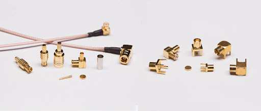

## 实验动机

动态洛伦兹力失谐是脉冲运行模式超导腔主要失谐因素，超导腔失谐会增加建场所需功率，在功率有限的情况下增加建场时间，造成压缩平顶时间，对幅度控制和相位控制造成影响。在失谐严重的情况下可能会导致不能有效建场。验证超导腔失谐补偿算法通常情况下需要在超导模组水平测试期间，而超导模组水平测试成本高、涉及系统复杂，而且水平测试时间紧凑，很难实时有效验证频控算法的有效性。

## 实验目的

本实验方案准备在室温下搭建一套简易的实验装置，用于模拟超导腔动态洛伦兹力失谐，用于验证超导腔失谐补偿算法。

## 实验方案

## 实验设备

----

超导腔

----

实验台架

----

Shaker piezo

----

调谐器

----

环形器

----

负载

----

信号发生器

----

LLRF（Mirco. TCA 4机箱）

----

piezo驱动器

----

步进电机驱动器

----

PC

----

射频线缆及接头等

