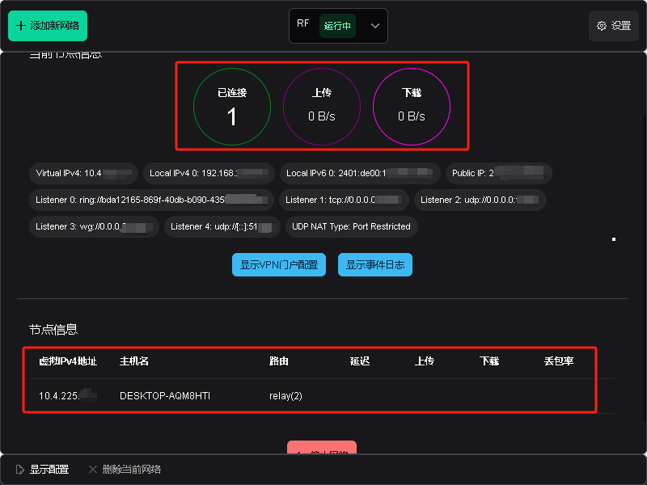

## 下载EasyTier

进入[EasyTier](https://github.com/EasyTier/EasyTier/releases)的Github界面下载适应计算机系统版本的安装包进行安装

----

## 安装EasyTier

按照安装软件的正常程序进行安装即可，安装位置可随意更改。

----

## 打开EasyTier

----

## 输入本机虚拟IP地址

----

## 输入同一组网的网络名称和密码

----

## 点击运行网络

----

## 检查是否在同一组网下

  

----

## 打开远程桌面连接

----

## 完成连接

注意：现在工作站使用的是流量下的外网，请不要传输大文件、打开ihepbox进行同步等耗费流量的操作！