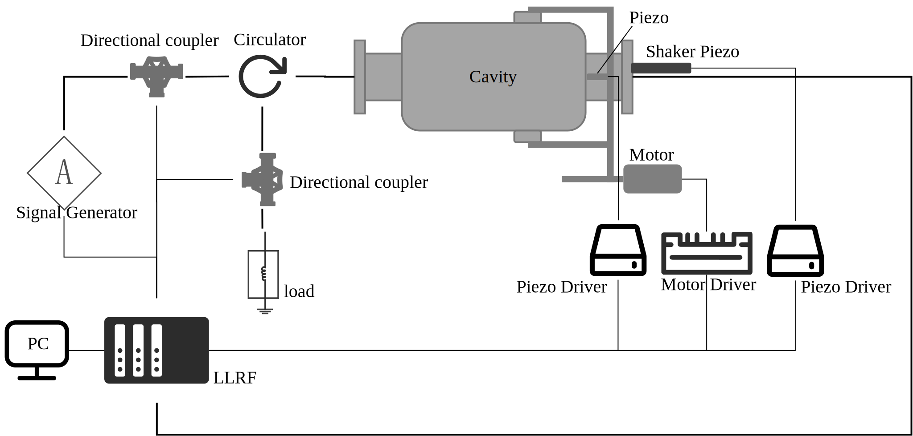
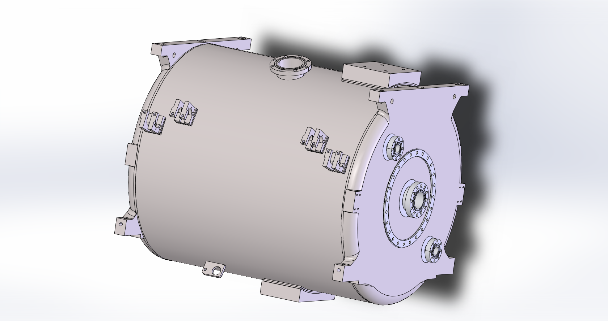
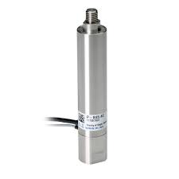
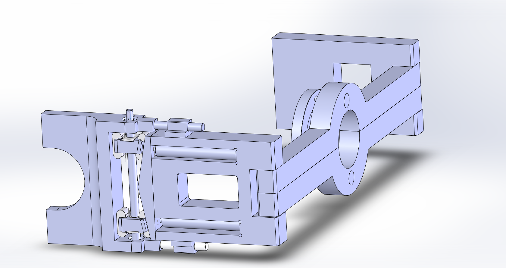
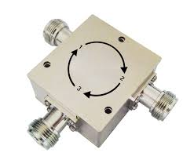
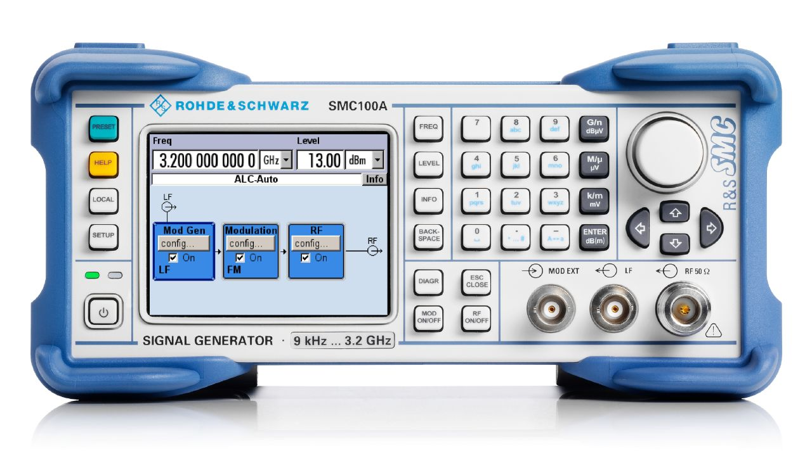
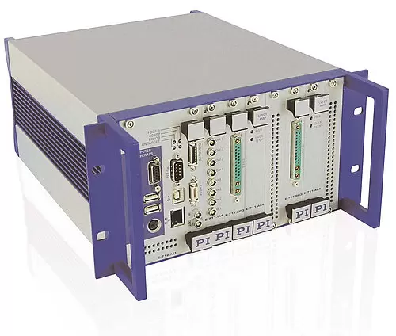
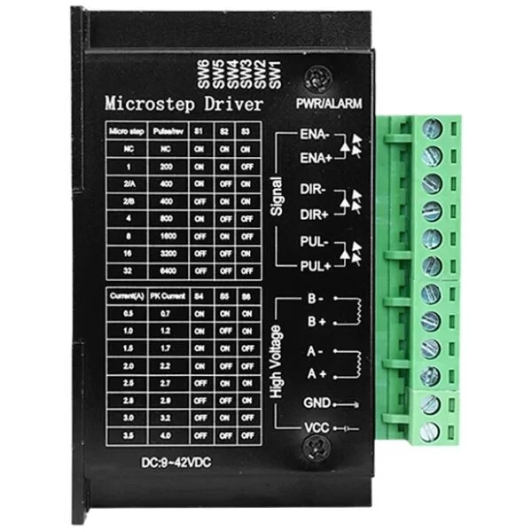
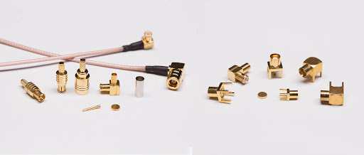

## 实验动机

动态洛伦兹力失谐是脉冲运行模式超导腔主要失谐因素，超导腔失谐会增加建场所需功率，在功率有限的情况下增加建场时间，造成压缩平顶时间，对幅度控制和相位控制造成影响。在失谐严重的情况下可能会导致不能有效建场。验证超导腔失谐补偿算法通常情况下需要在超导模组水平测试期间，而超导模组水平测试成本高、涉及系统复杂，而且水平测试时间紧凑，很难实时有效验证频控算法的有效性。

## 实验目的

本实验方案准备在室温下搭建一套简易的实验装置，用于模拟超导腔动态洛伦兹力失谐，用于验证超导腔失谐补偿算法。

## 实验方案

## 实验设备

----

超导腔

----

实验台架

----

Shaker piezo

----

调谐器

----

环形器

----

负载

----

信号发生器

----

LLRF（Mirco. TCA 4机箱）

----

## LLRF功能
- 采集前向、反射、腔压 射频信号
- 驱动 Shaker Piezo (直接给到Piezo驱动器，电压0~4V)
- 控制 步进电机 (给到电机驱动器，三个信号：脉冲、方向、使能)
- 驱动 压电陶瓷 (直接给到Piezo驱动器，电压0~4V)
- 触发信号（使Shaker Piezo、腔、调谐器piezo信号同步）

----

piezo驱动器

----

步进电机驱动器

----

PC

----

射频线缆及接头等

----

## 采购列表

<iframe src="https://shimo.im/file-invite/ZtbqqiaCvcv96Cy332p4ytNQan9a6/" width="100%" height="600px"></iframe>

## Comment

<noscript>
    Please enable JavaScript to view the 
    <a href="https://disqus.com/?ref_noscript" rel="nofollow">
        comments powered by Disqus.
    </a>
</noscript>